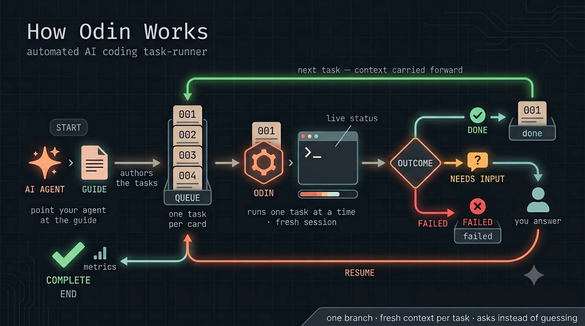

# Odin

> Headless [Claude Code](https://code.claude.com/docs) task orchestrator — runs a queue of tasks through `claude -p`, one at a time, each in a fresh session.

<p align="center">
  
</p>

Odin feeds a queue of task files into Claude Code running headless in a target
project, **one task at a time, each in a fresh session**. It carries context
forward between tasks, runs the whole batch on a single branch, and stops
cleanly to ask you a question when the agent hits a decision it shouldn't guess.

It stays deliberately dumb: Odin owns *sequencing* and the small *protocol* it
needs to read the agent's output. Your project's `CLAUDE.md` owns the *workflow*
(when to test, commit, branch). Zero runtime dependencies — Python stdlib only.

## Who it's for

Developers who use Claude Code and have a batch of well-scoped tasks to run
unattended — refactors, scaffolding, migrations, follow-the-recipe changes —
and want them executed in sequence with context carried forward, instead of
babysitting one prompt at a time.

## How it works

1. You write one Markdown file per task into `queue/<batch>/pending/` — the file
   body *is* the prompt.
2. `odin run` verifies a clean tree, picks one branch for the batch, then runs
   each task through `claude -p` in your project — fresh session, picking up
   your `CLAUDE.md`.
3. Each task ends with a hidden sentinel: **done** (Odin carries its hand-off
   note into the next task) or **needs input** (Odin shows you the question and
   waits for an answer).
4. The agent commits per your `CLAUDE.md`; Odin never commits, pushes, or opens
   PRs — it only positions the branch.

## Install

Requires [`uv`](https://docs.astral.sh/uv/) and the `claude` CLI on your `PATH`.

```sh
uv tool install --from 'git+https://github.com/hglattergotz/odin@v0.2.1' odin
odin --version
```

Upgrade by installing a newer tag (e.g. a later `@vX.Y.Z`); see [CHANGELOG.md](CHANGELOG.md).

## Quickest start — let your agent set it up

You don't have to learn Odin's queue or task format. From inside any project that
uses Claude Code, just point your agent at the built-in guide:

> **"Run `odin guide` and follow it, then set up an Odin queue to add full-text search to the API."**

`odin guide` prints a complete, self-contained manual — queue layout, task-file
format, the sentinel protocol, the run flow — so the agent can author a valid
`queue/<name>/pending/` task set (and any `CLAUDE.md` tweaks) with no other
context. Then you run it and watch it work:

```sh
odin run <name>
```

That's the loop: your agent plans and writes the queue, you run it. Everything
below is the underlying detail — read it if you'd rather wire things up yourself
or want to know what's happening under the hood.

## Authoring a queue yourself

Prefer to drive it by hand? A queue is just Markdown files. From any project that
has a `CLAUDE.md`:

```sh
cd ~/code/myproject
mkdir -p queue/add-search/pending
# drop task files in, e.g. queue/add-search/pending/001-add-endpoint.md

odin run add-search --branch add-search --base main
```

Each task runs in a fresh Claude session inside `myproject`, carries context to
the next, and lands on the `add-search` branch. When a task needs a decision,
Odin shows the question right in your terminal — press Enter to take the
recommendation or type an answer, and it continues. `odin status` shows where
every queue stands. That's the whole loop.

## Live tab status

While a run is in flight, Odin paints its own terminal tab so a long batch is
readable at a glance — without watching the scroll. By default it sets the tab
**title** (`odin ✓ 3/7 add-search`) and an in-tab **progress bar** that fills as
the queue drains; both are universally safe and ignored by terminals that don't
support them (`--no-title` opts out). In iTerm2, `--notify` adds a dock bounce,
a notification, and a **tab color** that flags held/failed/done state. With
`--completed-file`, Odin drops a metadata-only `COMPLETED.md` in the queue dir
that a paired interactive Claude session can read on your next prompt.

Everything is stdlib-only, best-effort, and metadata-only (never task bodies or
agent output). For the iTerm2 setup and the per-project tab-color shell hook,
see [docs/iterm2-setup-guide.md](docs/iterm2-setup-guide.md). To set this up,
point your agent at it: run `odin guide terminal` and follow it — it's an
agent-executable manual that does the install, the shell hook, and the verify.

The streamed run output itself is **styled** for scannability — each task is
framed by a colored rule header and a `✓`/`✗`/`⏸` footer, agent text blocks get
a `⏺` bullet with their tool calls indented beneath, and paths show relative to
the project. Color is emitted only to a TTY; `--no-color` (or the standard
`NO_COLOR`, or `ODIN_NO_COLOR=1`) turns the ANSI off while keeping the glyphs
and layout, so piped/CI output stays plain.

## Help & learning the format

```sh
odin -h          # all commands and flags
odin run -h      # options for a subcommand
odin guide       # full task-authoring manual (queue layout, task files, protocol)
```

Commands: `run`, `status`, `resume`, `archive`, `metrics`, `guide`, `demo`.

`odin guide` prints the full authoring manual — it's exactly what your agent
reads in [Quickest start](#quickest-start--let-your-agent-set-it-up). To try the
whole flow end-to-end on a throwaway project:

```sh
odin demo /tmp/otest && cd /tmp/otest && odin run --no-git
```

## Development

```sh
uv sync          # set up .venv from uv.lock
uv run pytest    # tests
uv run odin -h   # run the live source without installing
```

Stdlib only at runtime; dev tools are pinned and locked with a 14-day minimum
package age (`tool.uv.exclude-newer`). See [CLAUDE.md](CLAUDE.md) for the full
contributor and supply-chain rules.

## License

[MIT](LICENSE) © Henning Glatter-Gotz
