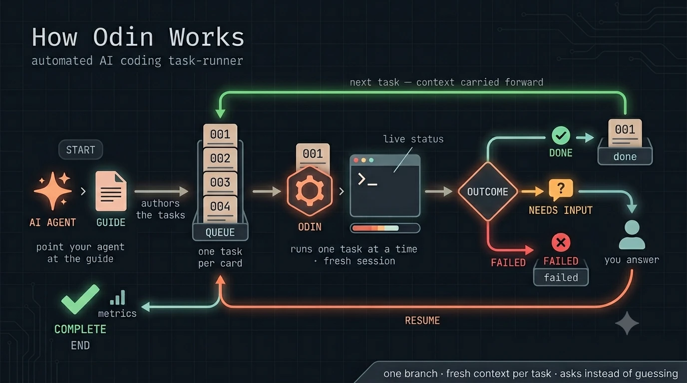

# Odin

> Headless multi-platform task orchestrator. Runs a queue of tasks through
> [Claude Code](https://code.claude.com/docs) (`claude`),
> [Cursor CLI](https://cursor.com/docs/cli/overview) (`agent`), or
> [Grok Build](https://docs.x.ai/build/overview) (`grok`), one at a time, each
> in a fresh session.

<p align="center">
  
</p>

Odin feeds a queue of task files into a headless agent CLI in a target
project, **one task at a time, each in a fresh session**. It carries context
forward between tasks, runs the whole batch on a single branch, and stops
cleanly to ask you a question when the agent hits a decision it should not
guess. You choose the product with `--platform` (or `$ODIN_PLATFORM` /
`default_platform` in config). There is no built-in default. See
[`docs/agent-backends.md`](docs/agent-backends.md) for the product,
`--platform`, and binary map.

It stays deliberately dumb: Odin owns *sequencing* and the small *protocol* it
needs to read the agent's output. Your project's instruction file
(`CLAUDE.md` or `AGENTS.md`) owns the *workflow* (when to test, commit,
branch). Zero runtime dependencies. Python stdlib only.

## Who it's for

Developers who use Claude Code, Cursor CLI, or Grok Build and have a batch of
well-scoped tasks to run unattended (refactors, scaffolding, migrations,
follow-the-recipe changes) and want them executed in sequence with context
carried forward, instead of babysitting one prompt at a time.

## How it works

1. You write one Markdown file per task into `queue/<batch>/pending/`. The file
   body *is* the prompt.
2. `odin run` verifies a clean tree, picks one branch for the batch, then runs
   each task through the selected agent CLI (`claude`, `agent`, or `grok`) in
   your project (fresh session, picking up your `CLAUDE.md` / `AGENTS.md`).
3. Each task ends with a hidden sentinel: **done** (Odin carries its hand-off
   note into the next task) or **needs input** (Odin shows you the question and
   waits for an answer).
4. The agent commits per your project instructions; Odin only positions the
   branch, and never pushes, merges, or opens PRs. The one commit Odin itself
   ever makes is the WIP checkpoint during
   [recovery](#when-a-run-gets-cut-off), and only with your consent.

## Install

Requires [`uv`](https://docs.astral.sh/uv/) and an agent CLI on your `PATH`
(`claude` for Claude Code, `agent` for Cursor CLI, or `grok` for Grok Build).

```sh
uv tool install --from 'git+https://github.com/hglattergotz/odin@stable' odin
odin --version
```

The `stable` branch always points at the latest release, so that command keeps
working. Upgrade later with `uv tool upgrade odin` (or re-run the install with
`--reinstall`). To pin an exact version instead, use `@vX.Y.Z` in place of
`@stable`; see [CHANGELOG.md](CHANGELOG.md).

## Quickest start: let your agent set it up

You do not have to learn Odin's queue or task format. From inside any project,
point your agent at the built-in guide:

> **"Run `odin guide` and follow it, then set up an Odin queue to add full-text search to the API."**

`odin guide` prints a complete, self-contained manual (queue layout, task-file
format, the sentinel protocol, the run flow) so the agent can author a valid
`queue/<name>/pending/` task set (and any instruction-file tweaks) with no
other context. Then you run it:

```sh
odin run <name> --platform claude   # or cursor / grok
```

That is the loop: your agent plans and writes the queue, you run it. Everything
below is the underlying detail. Read it if you would rather wire things up
yourself or want to know what is happening under the hood.

## Authoring a queue yourself

Prefer to drive it by hand? A queue is just Markdown files. From any project
that has a `CLAUDE.md` (or `AGENTS.md` for Cursor):

```sh
cd ~/code/myproject
mkdir -p queue/add-search/pending
# drop task files in, e.g. queue/add-search/pending/001-add-endpoint.md

odin run add-search --platform claude --branch add-search --base main
# Cursor CLI:  odin run add-search --platform cursor --branch add-search --base main
# Grok Build:  odin run add-search --platform grok   --branch add-search --base main
```

Each task runs in a fresh agent session inside `myproject`, carries context to
the next, and lands on the `add-search` branch. When a task needs a decision,
Odin shows the question in your terminal. Press Enter to take the
recommendation or type an answer, and it continues. `odin status` shows where
every queue stands. That is the whole loop.

> **Tip: version control.** As it runs, Odin creates run-state dirs under
> `queue/` (`running/`, `done/`, `held/`, `carry/`, …). Most projects add
> `queue/` to `.gitignore` so that churn stays out of git, unless you *want* the
> task files tracked in history, in which case keep it tracked.

## Live tab status

While a run is in flight, Odin paints its own terminal tab so a long batch is
readable at a glance without watching the scroll. By default it sets the tab
**title** (`odin ✓ 3/7 add-search`) and an in-tab **progress bar** that fills as
the queue drains; both are universally safe and ignored by terminals that do not
support them (`--no-title` opts out). In iTerm2, `--notify` adds a dock bounce,
a notification, and a **tab color** that flags held/failed/done state. With
`--completed-file`, Odin drops a metadata-only `COMPLETED.md` in the queue dir
that a paired interactive agent session can read on your next prompt.

Everything is stdlib-only, best-effort, and metadata-only (never task bodies or
agent output). For the iTerm2 setup and the per-project tab-color shell hook,
see [docs/iterm2-setup-guide.md](docs/iterm2-setup-guide.md). To set this up,
point your agent at it: run `odin guide terminal` and follow it. It is an
agent-executable manual that does the install, the shell hook, and the verify.

The streamed run output itself is **styled** for scannability. Each task is
framed by a colored rule header and a `✓`/`✗`/`⏸` footer; agent text blocks get
a `⏺` bullet with their tool calls indented beneath; paths show relative to
the project. Color is emitted only to a TTY; `--no-color` (or the standard
`NO_COLOR`, or `ODIN_NO_COLOR=1`) turns the ANSI off while keeping the glyphs
and layout, so piped/CI output stays plain.

## When a run gets cut off

A task can stop for a reason that says nothing about the quality of the work:
the agent CLI hits a **provider usage limit** mid-task, the process is killed,
or Odin itself dies. Odin tells that apart from a genuine failure — a task the
agent ended on its own terms without emitting a sentinel — and routes it to
`queue/<name>/interrupted/` instead of `failed/`, alongside a
`NNN-slug.recovery.md` sidecar recording what the attempt got done.

`odin recover` puts it back to work. It commits whatever partial work is in the
tree as a single `wip(odin): …` checkpoint (so the tree is clean and the next
run's clean-tree check passes), merges a **resumption brief** into the task body
— which commit holds the predecessor's work, which commit was the last real
milestone, what it said before it stopped — and moves the task back to
`pending/`. Plain `odin run` is the primary door: on a TTY it spots the
interrupted task at startup and offers to recover it.

**Unattended runs never commit on your behalf.** They halt at exit **12** and
print the command instead. Two flags opt in:

```sh
# hit a usage limit at 02:00 → commit the partial work, sleep until the window
# reopens, then carry on through the rest of the queue in the same process
odin run add-search --platform claude --branch add-search --base main \
    --recover --wait-for-reset
```

`--recover` authorises the WIP checkpoint commit and requeue without asking;
`--wait-for-reset` sleeps until the reset time the provider stated, capped by
`--max-wait` (default 360 minutes, so a 5-hour window fits). Note that `-y` /
`--yes` deliberately does **not** imply `--recover` — it only skips the
platform/model confirmation, and a script passing it is not thereby consenting
to Odin writing a commit.

One limitation worth knowing: if the provider's notice carries no reset time
Odin can parse, there is nothing to sleep until. Routing to `interrupted/` still
works (it is decided structurally, not by recognising any provider's wording),
but the run recovers the task and stops at exit 12 rather than guessing how long
to wait. Re-run it when the limit lifts.

Repeated interruption of one task is normal — a large task legitimately spans
several usage windows — so the circuit breaker is **progress, not attempt
count**: two consecutive attempts with no turns and no file changes block
further recovery (`--force` overrides), on the grounds that the problem is
environmental rather than a limit.

## Command examples

```sh
# run a named queue on its own branch, cut from main
odin run add-search --platform claude --branch add-search --base main

# same, but survive a usage limit unattended (see above)
odin run add-search --platform claude --branch add-search --base main \
    --recover --wait-for-reset

# preview what the next task would send — resolved argv and prompt, no agent run
odin run add-search --platform claude --dry-run

# try a new queue out: run two tasks, then stop
odin run add-search --platform claude --max-tasks 2

# where does everything stand?
odin status queue          # every named queue, most recently active first
odin status add-search     # drill into one

# a task asked you a question and is sitting in held/
odin resume 005-schema-choice add-search

# a task was cut off mid-work: see the plan first, then do it
odin recover add-search --dry-run
odin recover add-search

# move every finished sub-queue into queue/archive/ to declutter status
odin archive

# usage and cost across every project
odin metrics
odin metrics --project asset-api --html
```

Bare queue names resolve under `./queue/`, so `odin run add-search` is
`odin run queue/add-search`. Persist a platform with
`odin config set default_platform claude` and you can drop `--platform`
entirely.

## Help and learning the format

```sh
odin -h          # all commands and flags
odin run -h      # options for a subcommand
odin guide       # full task-authoring manual (queue layout, task files, protocol)
```

Commands: `run`, `status`, `resume`, `recover`, `archive`, `metrics`, `guide`,
`config`.

`odin guide` prints the full authoring manual. It is exactly what your agent
reads in [Quickest start](#quickest-start-let-your-agent-set-it-up). Topics
include `claude-md`, `agent-md` (Cursor / AGENTS.md), `protocol`, and
`terminal`.

## Development

```sh
uv sync          # set up .venv from uv.lock
uv run pytest    # tests
uv run odin -h   # run the live source without installing
```

To install (or refresh) the global `odin` command from this checkout after a
pull:

```sh
./scripts/install-tool.sh
# or: ./scripts/install-tool.sh --editable
```

Stdlib only at runtime; dev tools are pinned and locked with a 14-day minimum
package age (`tool.uv.exclude-newer`). See [CLAUDE.md](CLAUDE.md) for the full
contributor and supply-chain rules.

## License

[MIT](LICENSE) © Henning Glatter-Gotz
